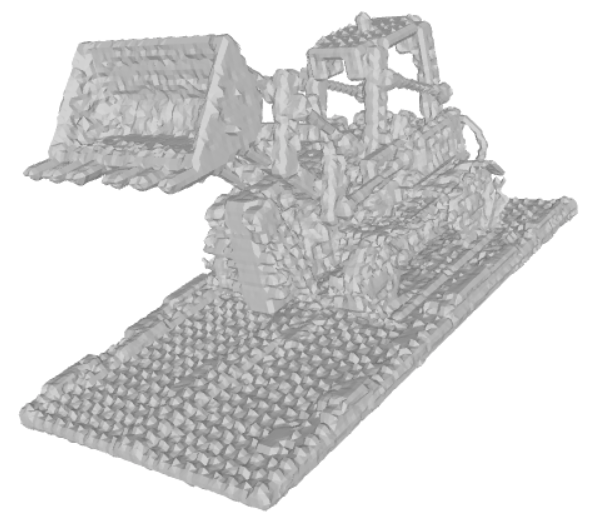
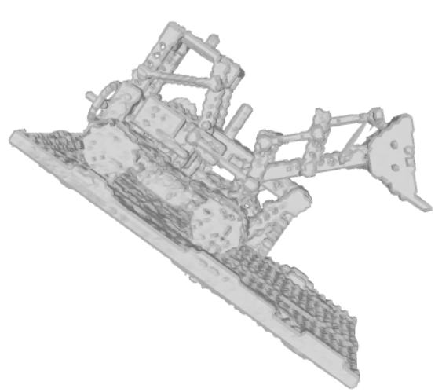

# NeRF
Simple PyTorch implementation of NeRF (Neural Radiance Fields).
(This project is currently under development)

# Installation
## Option 1: Using pip
```bash
git clone https://github.com/murumura/NeRF.git
cd NeRF-Simple
pip install -r environment.txt
```
## Option 2: Using provided docker enviorment

I have the dockerfile needed to build the environment for this project, for those who are familiar with the basic operations of docker are very welcome to execute this project directly through the provieded dockerfile in `docker/dockerfile` and building/running scripts(`docker/docker_build.sh` and `docker/docker_run.sh`).
```bash
git clone https://github.com/murumura/NeRF-Simple.git
cd NeRF-Simple
cd docker
sh docker_build.sh
```
# How To Run?
## Quick Start
Once everything is setup, to run experiments, first edit `configs/lego.txt` to specify your own parameters.
(For details of training options, please refer to `src/opt.py`)

Invoked training procedure by :
```bash
python src/train.py --config configs/lego.txt --train True
```

## Mesh reconstruction
For those who want to output the synthesis result  into a mesh, you need to additionly install [PyMCubes](https://github.com/pmneila/PyMCubes)
```bash
pip install PyMCubes
```
Then invoked mesh reconstruction by :
```bash
python src/MeshExtraction.py --config configs/lego.txt --eval True
```
<p align="center" width="100%">
     
     
</p>

## Pretrained model
```bash
pretrained/
└── lego.ckpt

```

## Datasets
### Synthetic datasets 
You can download the blender dataset from paper authors's link [here](https://drive.google.com/file/d/18JxhpWD-4ZmuFKLzKlAw-w5PpzZxXOcG/view?usp=sharing). 
Unzip and place the downloaded directory in `./data/datasets` for later training. See the following directory structure for an example:
```bash
data/
└── datasets
    └── nerf_synthetic
        ├── chair
        ├── drums
        ├── ficus
        ├── hotdog
        ├── lego
        ├── materials
        ├── mic
        ├── README.txt
        └── ship
```